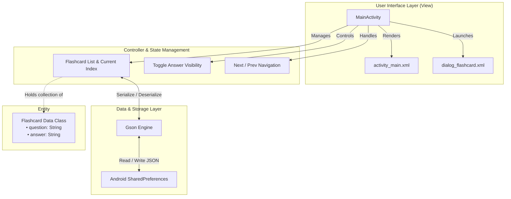

# 🧠 Flashcard Quiz App

<p align="center">
  
  
  
  
  
  
  
</p>

---

## 📌 Table of Contents

- [Overview](#-overview)
- [Key Features](#-key-features)
- [Application Architecture](#-application-architecture)
- [Tech Stack & Libraries](#-tech-stack--libraries)
- [Project Directory Structure](#-project-directory-structure)
- [Data Storage & Persistence](#-data-storage--persistence)
- [Getting Started](#-getting-started)
  - [Prerequisites](#prerequisites)
  - [Installation & Build](#installation--build)
- [Application Workflow & Usage](#-application-workflow--usage)
- [Permissions & Compatibility](#-permissions--compatibility)
- [Future Roadmap](#-future-roadmap)
- [Contributing](#-contributing)
- [License](#-license)

---

## 📖 Overview

**Flashcard Quiz App** is an intuitive, interactive, and lightweight Android learning tool designed to facilitate active recall and self-testing. Built with modern Android development standards using **Kotlin**, **Material Components**, and **Android Jetpack**, the application allows users to study pre-loaded trivia flashcards or create, update, and manage their own personalized study decks.

Data is saved locally on the device using **Google Gson** serialization and Android's **SharedPreferences**, guaranteeing that customized flashcards remain available offline without requiring external network access or complicated backend setups.

---

## ✨ Key Features

### 🗂️ 1. Interactive Study Mode
- **Active Recall Reveal:** Questions are displayed cleanly in an elevated flashcard view. The answer remains hidden until the user toggles the **"Show Answer"** button.
- **Bi-Directional Navigation:** Effortlessly flip through the deck using **Previous** and **Next** buttons. The deck supports wrap-around cycling, allowing continuous review.
- **Dynamic Toggle States:** The action button dynamically changes between *"Show Answer"* and *"Hide Answer"*, automatically resetting visibility when jumping to the next question.

### ✏️ 2. Full Flashcard Management (CRUD)
- **Add New Cards:** Quickly expand the deck by tapping **"Add"**. A custom Material Dialog prompts for both Question and Answer fields with input validation.
- **Edit Existing Cards:** Update questions or clarify answers at any time with the **"Edit"** option, pre-populating fields with current card details.
- **Delete Cards:** Clean up mastered or unwanted cards with one tap via **"Delete"**, automatically keeping deck indices synchronized.
- **Starter Deck Included:** Automatically boots with 5 built-in trivia and logic questions if no previous study data exists.

### 💾 3. Seamless Offline Persistence
- **Instant Save & Load:** Any addition, modification, or deletion is instantly serialized into formatted JSON through **Google Gson** and persisted into device storage (`SharedPreferences`).
- **Zero Cloud Dependence:** Complete offline privacy and instant load times.

### 🛡️ 4. Modern Android 14/15 Support
- **Android 13+ (API 33) Runtime Permissions:** Built-in proactive permission request for `POST_NOTIFICATIONS`.
- **Edge-to-Edge Experience:** Optimized UI layout with translucent status bar support on Lollipop and newer devices.

---

## 🏛 Application Architecture

The project follows a clean and lightweight component architecture:



---

## 🛠 Tech Stack & Libraries

| Category | Technology / Library | Version | Description |
| :--- | :--- | :--- | :--- |
| **Language** | [Kotlin](https://kotlinlang.org/) | `2.0.21` | Modern, expressive, and concise programming language |
| **Build System** | [Gradle (Kotlin DSL)](https://gradle.org/) | `8.13.0` (AGP) | Scalable build automation with Version Catalog |
| **Core Framework** | [AndroidX Core KTX](https://developer.android.com/kotlin/ktx) | `1.13.1` | Idiomatic Kotlin extensions for Android OS APIs |
| **UI Components** | [Material Components](https://github.com/material-components/material-components-android) | `1.12.0` | Google Material Design UI widgets and styling |
| **Layouts** | [ConstraintLayout](https://developer.android.com/reference/androidx/constraintlayout/widget/ConstraintLayout) | `2.2.0` | Flexible and flat view hierarchies |
| **Data Parsing** | [Google Gson](https://github.com/google/gson) | `2.11.0` | Fast JSON serialization and deserialization |
| **Modern UI Ready** | [Jetpack Compose BOM](https://developer.android.com/jetpack/compose) | `2024.09.00` | Foundation ready for Compose UI migration |
| **Target SDK** | Android SDK | `36` (Android 15+) | Built against the latest Android platform APIs |
| **Minimum SDK** | Android SDK | `24` (Android 7.0) | Accessible to over 95%+ active Android devices |

---

## 📁 Project Directory Structure

```text
Flashcard-Quiz-main/
│
├── gradle/
│   ├── wrapper/
│   │   ├── gradle-wrapper.jar
│   │   └── gradle-wrapper.properties
│   └── libs.versions.toml             # Gradle Version Catalog for dependencies
│
├── app/
│   ├── build.gradle.kts               # Module-level build & dependency configuration
│   ├── proguard-rules.pro             # Proguard obfuscation & shrinking rules
│   └── src/
│       ├── main/
│       │   ├── AndroidManifest.xml    # App manifest with permissions & activity definitions
│       │   ├── java/com/example/flashcardapp/
│       │   │   ├── MainActivity.kt    # Core logic: Quiz navigation, CRUD dialogs & persistence
│       │   │   └── ui/theme/          # Compose theme typography, colors, and styling
│       │   │       ├── Color.kt
│       │   │       ├── Theme.kt
│       │   │       └── Type.kt
│       │   └── res/
│       │       ├── layout/
│       │       │   ├── activity_main.xml       # Main quiz screen layout
│       │       │   └── dialog_flashcard.xml    # Custom dialog layout for Add/Edit cards
│       │       ├── values/
│       │       │   ├── colors.xml              # Theme color definitions
│       │       │   ├── strings.xml             # App string resources
│       │       │   └── themes.xml              # DayNight Material theme settings
│       │       └── drawable/                   # Vectors and UI drawables
│       ├── test/                              # Local unit tests
│       └── androidTest/                       # Android instrumentation tests
│
├── build.gradle.kts                   # Top-level build configuration
├── settings.gradle.kts                # Project name & repository management
├── gradlew & gradlew.bat              # Gradle wrapper scripts
└── README.md                          # Project documentation
```

---

## 💾 Data Storage & Persistence

The app stores flashcards as a JSON array in **SharedPreferences** under the private key `"flashcards"`.

### Data Model
```kotlin
data class Flashcard(
    var question: String,
    var answer: String
)
```

### JSON Structure Example
```json
[
  {
    "question": "What is the capital of France?",
    "answer": "Paris"
  },
  {
    "question": "Who developed Android?",
    "answer": "Google"
  },
  {
    "question": "What is 5 + 7?",
    "answer": "12"
  },
  {
    "question": "Which number comes next in 2, 4, 8, 16?",
    "answer": "32"
  },
  {
    "question": "What has keys but can’t open locks?",
    "answer": "A piano"
  }
]
```

---

## 🚀 Getting Started

Follow these instructions to get a copy of the project up and running on your local machine for development and testing.

### Prerequisites

- **Android Studio:** Android Studio Iguana / Jellyfish / Ladybug or newer.
- **JDK:** Java Development Kit (JDK) 11 or higher.
- **Android SDK:** Platform SDK 36 (or compatible SDK installed via Android Studio SDK Manager).
- **Physical Device or Emulator:** Running Android 7.0 (API level 24) or higher.

### Installation & Build

1. **Clone the Repository:**
   ```bash
   git clone https://github.com/SorathiyaDhruvin/Flashcard-Quiz-main.git
   cd Flashcard-Quiz-main
   ```

2. **Open in Android Studio:**
   - Launch Android Studio.
   - Select **Open an Existing Project** and navigate to the cloned folder.
   - Allow Gradle to sync dependencies and index the project.

3. **Build the Project:**
   - From the terminal inside the root project directory:
     ```bash
     # On Windows:
     gradlew.bat assembleDebug

     # On macOS/Linux:
     ./gradlew assembleDebug
     ```

4. **Run the App:**
   - Connect an Android device with USB debugging enabled, or start an Android Emulator.
   - Click the green **Run (▶)** button in Android Studio, or execute:
     ```bash
     # Install on connected device/emulator
     gradlew.bat installDebug
     ```

---

## 📱 Application Workflow & Usage

1. **Studying Cards:**
   - Read the question in the blue top container.
   - Tap **"Show Answer"** to reveal the answer in the yellow bottom container.
   - Tap **"Next"** or **"Previous"** to move sequentially through your deck.
2. **Adding a New Flashcard:**
   - Tap the **"Add"** button.
   - Enter your prompt into the *Question* field and the solution into the *Answer* field.
   - Tap **"Save"**. Your new card is immediately appended and displayed.
3. **Editing a Flashcard:**
   - Navigate to the card you want to adjust and tap **"Edit"**.
   - Modify the question or answer text, then tap **"Save"**.
4. **Deleting a Flashcard:**
   - Navigate to the card you want to remove and tap **"Delete"**.
   - The card is removed and the deck view automatically refreshes.

---

## 🔐 Permissions & Compatibility

| Permission | Purpose | SDK Constraint |
| :--- | :--- | :--- |
| `android.permission.POST_NOTIFICATIONS` | Allows scheduling future study reminders and review alerts | Android 13 (API 33)+ |

- **Minimum Supported Android Version:** Android 7.0 (API Level 24)
- **Target Android Version:** Android 15 (API Level 36)

---

## 🔮 Future Roadmap

- [ ] **3D Card Flip Animation:** Add smooth CardView 3D flip animation using `androidx.transition`.
- [ ] **Deck Categories & Tags:** Group flashcards by subject (e.g., Computer Science, Languages, History).
- [ ] **Spaced Repetition System (SRS):** Implement Leitner system or SM-2 algorithms for optimized learning intervals.
- [ ] **Jetpack Compose UI:** Migrate XML layouts to a full declarative Jetpack Compose UI.
- [ ] **Quiz & Score Mode:** Multiple-choice quiz options with performance tracking and accuracy metrics.
- [ ] **Import / Export Decks:** Export decks to JSON / CSV files and import shared decks.

---

## 🤝 Contributing

Contributions are welcome! If you'd like to improve the app or add new features:

1. Fork the Project (`https://github.com/SorathiyaDhruvin/Flashcard-Quiz-main/fork`)
2. Create your Feature Branch (`git checkout -b feature/AmazingFeature`)
3. Commit your Changes (`git commit -m 'Add some AmazingFeature'`)
4. Push to the Branch (`git push origin feature/AmazingFeature`)
5. Open a Pull Request

---

## 📄 License

This project is licensed under the **MIT License** - see the [LICENSE](LICENSE) file for details.

---

<p align="center">
  Crafted with ❤️ by <a href="https://github.com/SorathiyaDhruvin">Dhruvin Sorathiya</a>
</p>
